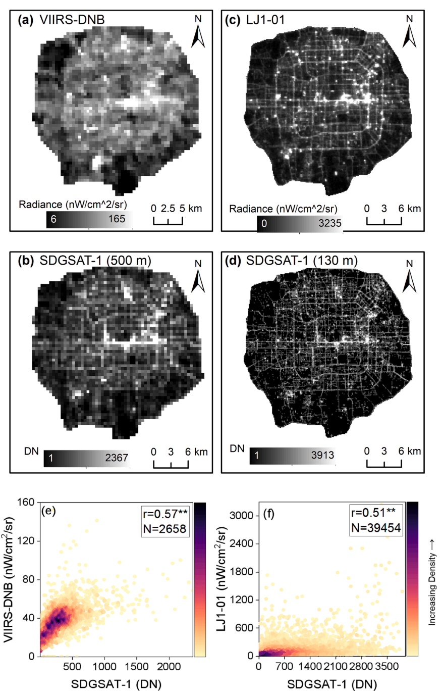
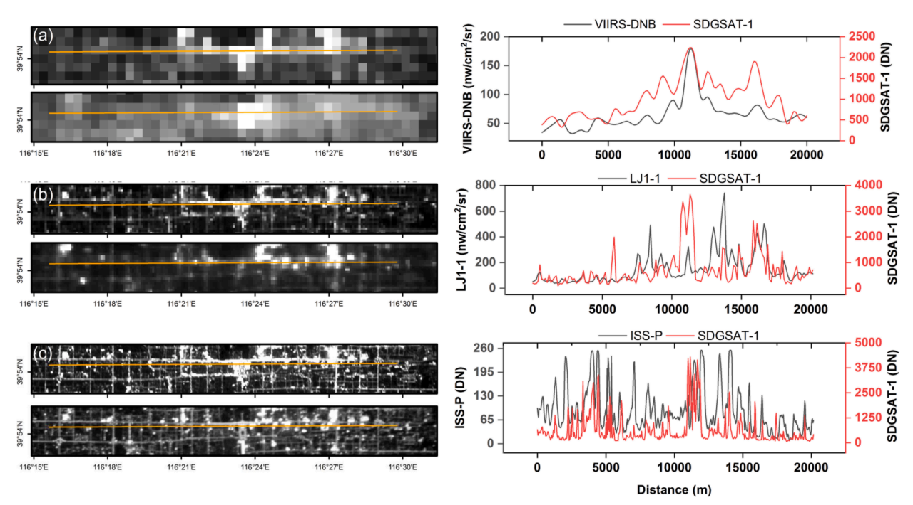
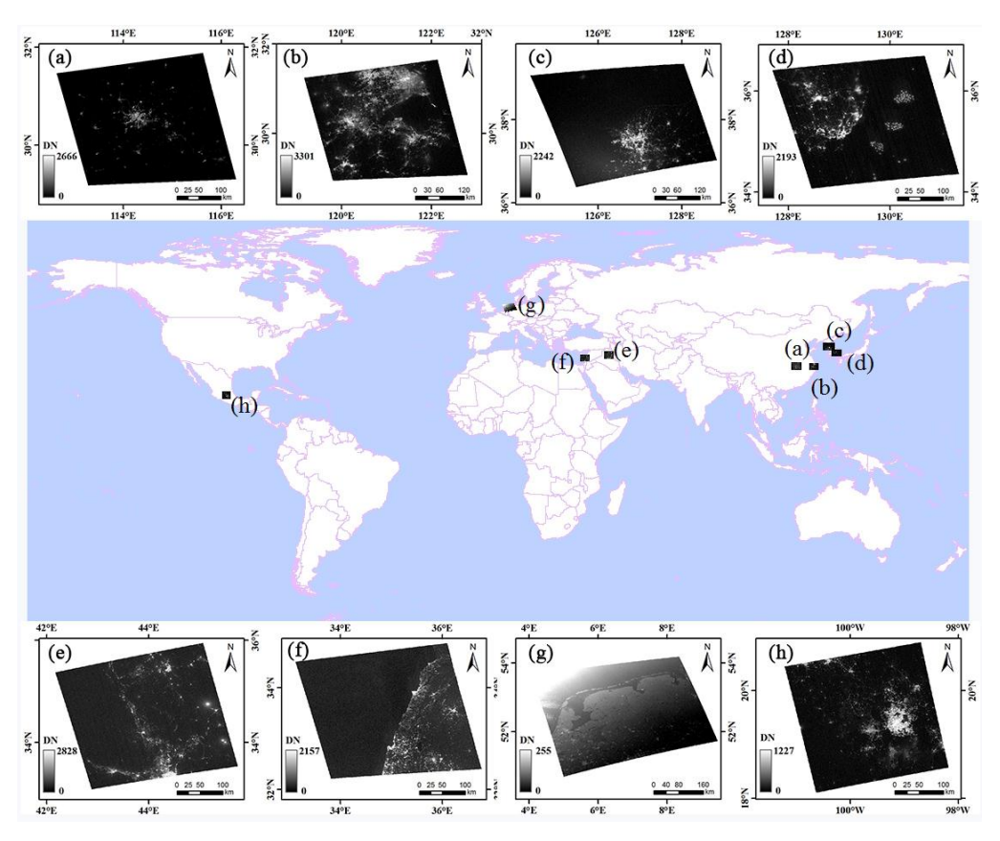
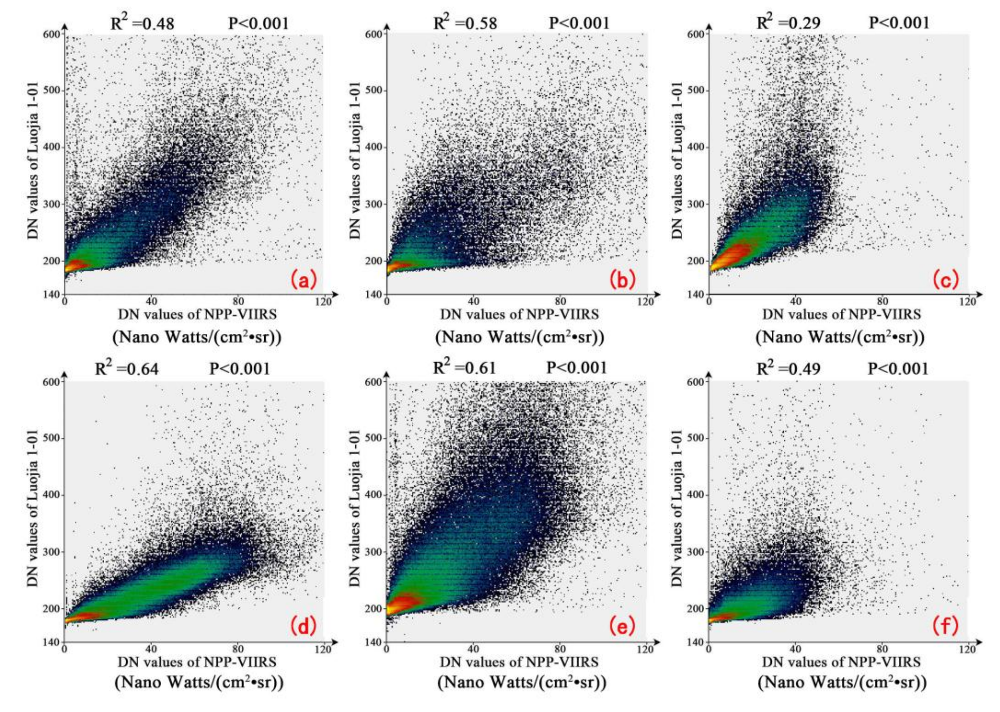

# Quantification

## Plotting

DN / radiance comparison and correlation between sensors[^1]:

{: style="width:600px"}

Pixel value comparisons for the transect lines ([^1] and [^4]):

{: style="width:800px"}

Nice overview plot[^5]:

{: style="width:800px"}

Better scatterplots with DN values[^5]:

{: style="width:700px"}

Some cool frameworks:

- [dashboard example](https://examples.holoviz.org/gallery/datashader_dashboard/datashader_dashboard.html)
- [NDVI example -> radiance](https://examples.holoviz.org/gallery/heat_and_trees/heat_and_trees.html)
- [4 tiles reacting at the same time](https://examples.holoviz.org/gallery/landsat/landsat.html)
- 

## Indexes / Statistical Tests

- Sum of total light (SOTL)[^1] (mentioned only once and not explained)
- Sum of Lights (SoL)[^2] - sum of intensity values over the region
- ANOVA for pixel wise comparison?

## Other Notes

- How to get from DN to L (radiance): SDGSat[^3]

[^1]: Guo, B., Hu, D., & Zheng, Q. (2023). Potentiality of SDGSAT-1 glimmer imagery to investigate the spatial variability in nighttime lights. International Journal of Applied Earth Observation and Geoinformation, 119, 103313. https://doi.org/10.1016/j.jag.2023.103313
[^2]: Mokhtari, Z., Bergantino, A. S., Intini, M., Elia, M., Buongiorno, A., Giannico, V., Sanesi, G., & Lafortezza, R. (2025). Nighttime light extent and intensity explain the dynamics of human activity in coastal zones. Scientific Reports, 15(1). https://doi.org/10.1038/s41598-025-85917-z
[^3]: Wang, Y., Huang, H., & Wu, B. (2025). Evaluating the Potential of SDGSAT-1 Glimmer Imagery for Urban Road Detection. IEEE Journal of Selected Topics in Applied Earth Observations and Remote Sensing, 18, 785–794. https://doi.org/10.1109/jstars.2024.3502218
[^4]: Weber, D., Bolliger, J., Ecker, K., Fischer, C., Ginzler, C., Gossner, M. M., Huber, L., Obrist, M. K., Zellweger, F., & Levin, N. (2025). Night lights from space: potential of <scp>SDGSAT</scp>‐1 for ecological applications. Remote Sensing in Ecology and Conservation. https://doi.org/10.1002/rse2.70011
[^5]: Jiang, W., He, G., Long, T., Guo, H., Yin, R., Leng, W., Liu, H., & Wang, G. (2018). Potentiality of Using Luojia 1-01 Nighttime Light Imagery to Investigate Artificial Light Pollution. Sensors, 18(9), 2900. https://doi.org/10.3390/s18092900
