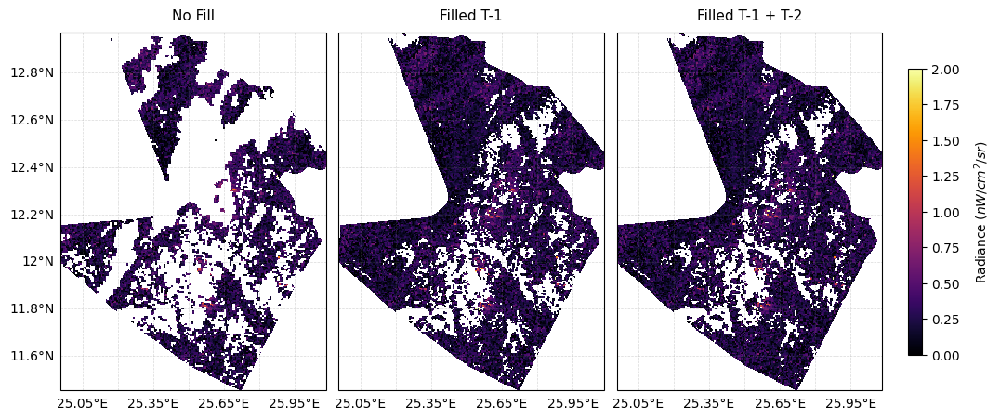

## Introduction

Monitoring armed conflict through NTL data requires high-quality, detailed observations capable of capturing rapidly evolving conditions. To ensure these requirements are met, we evaluate the suitability of the satellite products (Black Marble, SDGSAT-1, EnMAP, and Landsat-8) across multiple dimensions:

- **data accessibility**: ease of obtaining and using the data (availability and licensing);
- **geographic coverage**: area covered by the observations;
- **spatial resolution**: level of spatial detail and minimum detectable feature size;
- **quality assurance**: presence of correction layers and indicators of data reliability;
- **temporal resolution**: frequency of data acquisition.

## Key Attributes of an Effective NTL Product

**Data Accessibility**. The accessibility of satellite data plays a crucial role in its practical usability. While openness is a key factor, effective access mechanisms are equally important. Black Marble and Landsat illustrate this well, offering well-documented application programming interfaces (APIs) and Python-based software development kits (SDKs) that enable efficient data retrieval and processing.

In contrast, EnMAP and SDGSAT‑1 rely primarily on web-based interfaces, which limit automation and make tasks such as downloading all tiles for a given period and region considerably more cumbersome. In particular, EnMAP does not allow filtering by acquisition time or other key metadata, rendering it nearly unsuitable for studies that require custom tile selection. Given the relatively modest development effort required to implement robust access points compared with the cost of launching and operating satellite missions, standardized APIs and SDKs should be regarded as an essential component of modern data access infrastructure.

| Characteristic | Black Marble | SDGSAT-1 | EnMAP | Landsat-8 |
| :--- | :--- | :--- | :--- | :--- |
| **Data Accessibility** | Full | Partial | None | Full |
| **Geographic Coverage** | Full | Partial | Partial | Full |
| **Spatial Resolution** | 500 m | 10 m* | 30 m | 30 m |
| **Quality Assurance** | Yes | No | No | Yes |
| **Temporal Resolution** | Daily | Every 11 days | Every 27 days | Every 16 days |

??? note 

    Asterisk (*) reports only the resolution corresponding to the panchromatic band.

**Geographic Coverage**. Beyond accessibility, spatial and temporal coverage are equally critical, especially when drawing conclusions across large regions. Black Marble’s daily global observations support consistent analysis across both space and time, whereas SDGSAT‑1 currently provides more limited geographical coverage. Although Landsat‑8 offers global imaging capabilities, nighttime acquisitions are not part of its routine observation schedule and must be explicitly requested. Existing studies of night-light scenes indicate that observations over many parts of the Global South are sparse or missing, suggesting that systematic nighttime coverage in these regions is largely absent [@landsat_ntl].

**Spatial Resolution**. Although Black Marble performs strongly in terms of accessibility, temporal coverage, and global coverage, its spatial resolution is a key limitation for detailed analysis. Current daytime sensors provide high levels of spatial detail—for example, Landsat and EnMAP with 30 m resolution in RGB bands, and SDGSAT‑1 reaching 10 m in panchromatic bands. By contrast, the NASA Black Marble product operates at a much coarser resolution of 15 arc-seconds, or roughly 500 m. This difference poses a major limitation: at 500 m pixel size, distinct light sources such as streetlights and individual buildings are aggregated into a single radiance value, leading to a “mixed pixel” effect that blurs the fine-scale features clearly visible in higher-resolution daytime imagery [@roman_2018].

**Quality Assurance**. NTL observations are inherently noisy, as they are affected by a range of environmental and atmospheric factors. Many products therefore include a separate quality band that encodes, as a continuous or categorical value, how trustworthy each pixel-level measurement is. Reliable NTL analysis therefore depends not only on access mechanisms and coverage but also on information about observation quality. Landsat provides cloud cover information as a separate band, and Black Marble includes a dedicated quality band, making it possible to assess data usability and identify valid observations. In contrast, SDGSAT‑1 and EnMAP do not offer such information, which makes it difficult to evaluate data quality directly.

{: style="width:900px"}

In principle, one could use cloud masks derived from other sensors, such as Landsat, as a proxy, but this approach is indirect and potentially inaccurate, since NTL observations are affected by additional noise sources, including aurora, wildfires, and lightning. When observations for a given overpass are missing or unusable, a common strategy is to “fill in” gaps using earlier measurements. However, this can shift the apparent timing of changes and smooth out short‑lived events. In low‑light rural settings, where signal levels are already close to the noise floor, such temporal smoothing further complicates the task of distinguishing genuine changes from measurement artifacts.

**Temporal Resolution**. Temporal resolution plays a central role in determining how useful NTL products are for humanitarian monitoring in two distinct ways. First, finer temporal resolution allows changes in radiance to be tracked at a higher temporal granularity, which is crucial for detecting and characterizing rapidly evolving events. Second, frequent observations enable the construction of multi‑day composites that discard low‑quality scenes while still maintaining acceptable temporal lag, thereby reducing noise and filling data gaps without losing sensitivity to short‑term dynamics. For example, the daily observations provided by Black Marble allow multi‑day composites to be constructed that both filter out low‑quality acquisitions and still closely follow short‑term variation in radiance. By contrast, SDGSAT‑1’s 11‑day repeat cycle implies that even a 3‑image composite spans more than a month, making it poorly suited to monitoring fast‑evolving situations such as armed conflicts, where timely detection of changes in radiance is essential.

Overall, the assessment indicates that only one of the considered products is practically viable for this application. Accessing EnMAP data for systematic analyses with custom temporal requirements is highly constrained, and Landsat, despite its good accessibility and coverage, provides too few nighttime acquisitions in much of the Global South. SDGSAT‑1 further lacks dedicated quality assurance information and offers insufficient temporal resolution for effective compositing. Consequently, despite its relatively coarse spatial resolution, Black Marble emerges as the only feasible NTL product among those examined, and the subsequent analysis therefore relies exclusively on Black Marble.